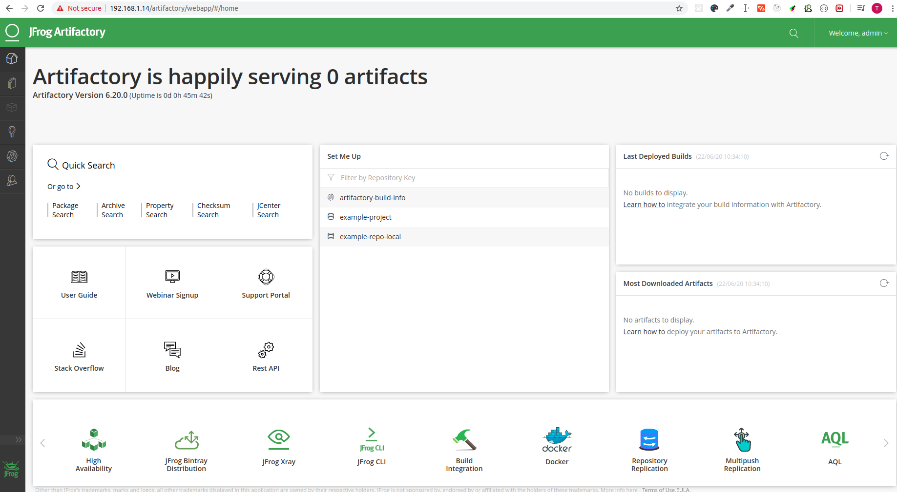

# Set up Artifactory
JFrog Artifactory is a universal DevOps solution providing end-to-end automation.
Management of binaries and artifacts through the application delivery process.
It helps to improves productivity activities

### Using docker-compose
```yaml
version: '2'
services:
  postgresql:
    image: docker.bintray.io/postgres:9.6.11
    container_name: postgresql
    restart: always
    ports:
     - 5432:5432
    environment:
     - POSTGRES_DB=artifactory
     # The following must match the DB_USER and DB_PASSWORD values passed to Artifactory
     - POSTGRES_USER=artifactory
     - POSTGRES_PASSWORD=password
    volumes:
     - /data/artifactory/postgresql:/var/lib/postgresql/data
    ulimits:
      nproc: 65535
      nofile:
        soft: 32000
        hard: 40000
  artifactory:
    image: docker.bintray.io/jfrog/artifactory-oss:6.20.0
    container_name: artifactory
    restart: always
    ports:
     - 8081:8081
    depends_on:
     - postgresql
    links:
     - postgresql
    volumes:
     - /data/artifactory/artifactory:/var/opt/jfrog/artifactory
    environment:
     - DB_TYPE=postgresql
     # The following must match the POSTGRES_USER and POSTGRES_PASSWORD values passed to PostgreSQL
     - DB_USER=artifactory
     - DB_PASSWORD=password
     # Add extra Java options by uncommenting the following line
     #- EXTRA_JAVA_OPTIONS=-Xms512m -Xmx4g
    ulimits:
      nproc: 65535
      nofile:
        soft: 32000
        hard: 40000
```

### Default account access
```text
Username: admin
Password: password
```

### Quickly
```bash
$ docker-compose up -d
```

### Demo

