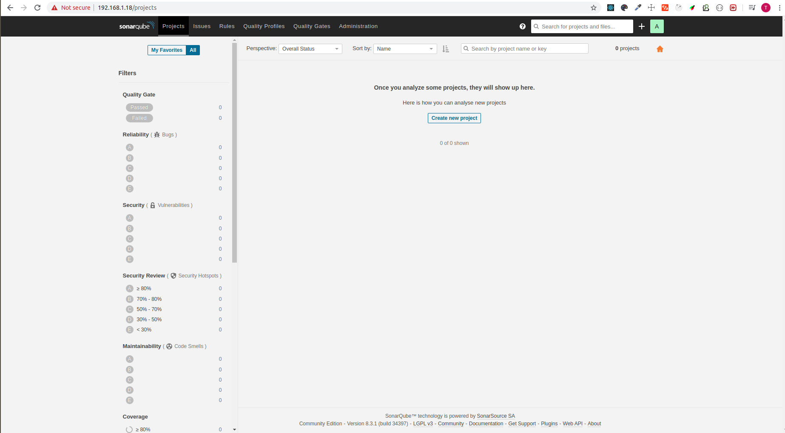

# Set up Sonarqube
SonarQube® is an automatic code review tool to detect bugs, vulnerabilities and code smells in your code. 
It can integrate with your existing workflow to enable continuous code inspection across your project branches and pull requests.

### Using docker-compose
```yaml
version: "3"
services:
  sonarqube:
    image: sonarqube
    expose:
      - 9000
    ports:
      - "0.0.0.0:9000:9000"
    networks:
      - sonarnet
    environment:
      - SONARQUBE_JDBC_URL=jdbc:postgresql://db:5432/sonar
      - SONARQUBE_JDBC_USERNAME=sonar
      - SONARQUBE_JDBC_PASSWORD=sonar
    volumes:
      - sonarqube_conf:/opt/sonarqube/conf
      - sonarqube_data:/opt/sonarqube/data
      - sonarqube_extensions:/opt/sonarqube/extensions
      - sonarqube_bundled-plugins:/opt/sonarqube/lib/bundled-plugins
  db:
    image: postgres
    networks:
      - sonarnet
    environment:
      - POSTGRES_USER=sonar
      - POSTGRES_PASSWORD=sonar
    volumes:
      - postgresql:/var/lib/postgresql
      - postgresql_data:/var/lib/postgresql/data

networks:
  sonarnet:

volumes:
  sonarqube_conf:
  sonarqube_data:
  sonarqube_extensions:
  sonarqube_bundled-plugins:
  postgresql:
  postgresql_data:
```
### Default account access
```text
Username: admin
Password: admin
```
### Quickly
```bash
$ docker-compose up -d
```
## Fixes
```text
# error ERROR: [1] bootstrap checks failed
# [1]: max virtual memory areas vm.max_map_count [65530] is too low, increase to at least [262144]

sudo sysctl -w vm.max_map_count=262144

```
### Demo

